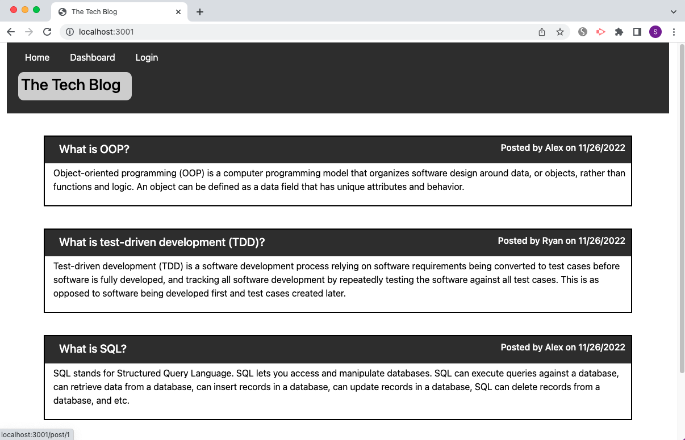
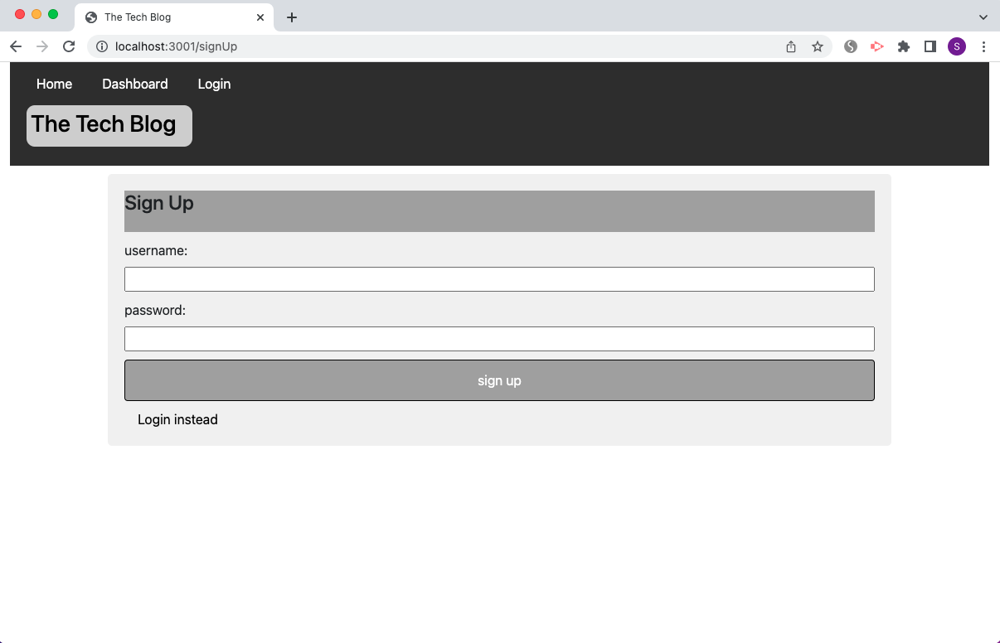
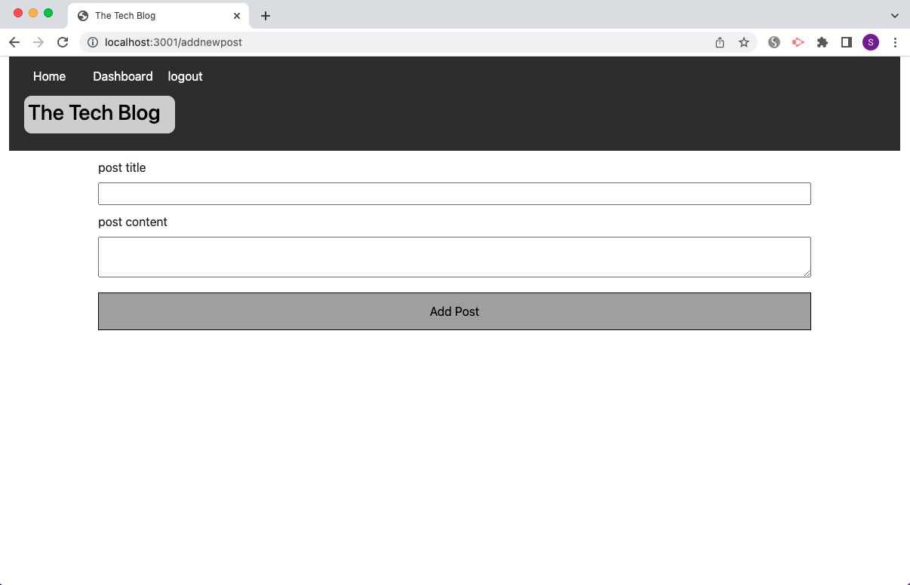
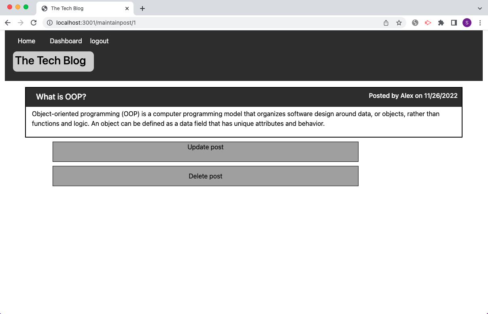
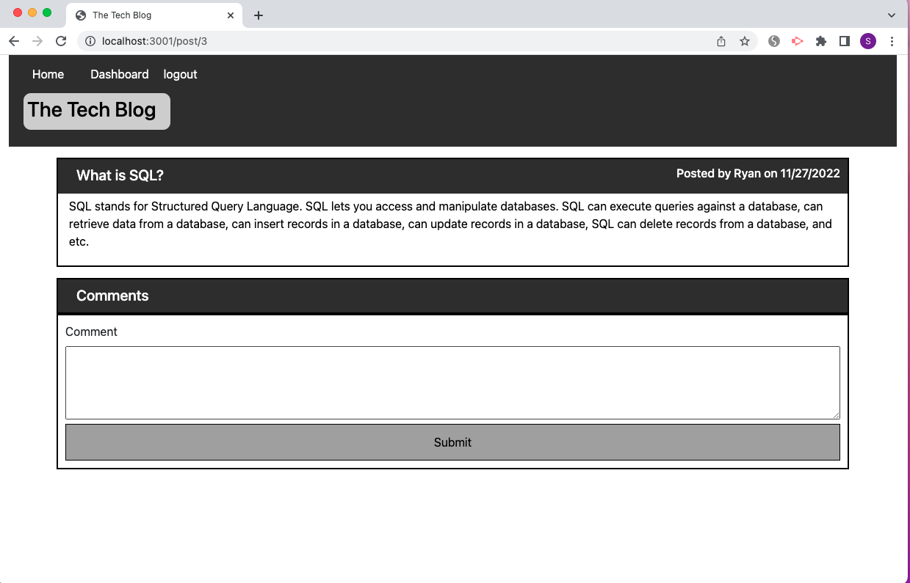

# Tech Blog 

## Description

This application is a tech blog site where developers can publish their blog posts and comment on other developer's posts as well.

Heroku URL: https://stormy-badlands-63717.herokuapp.com/

## Installation

Run `npm i` to install dependencies.

## Usage

1. Run `source schema.sql` and `source seeds.sql` in mysql command line.

2. Run `npm start` in the command line to start the application.

## Credits

N/A

## License

Please refer to the LICENCE in the repo